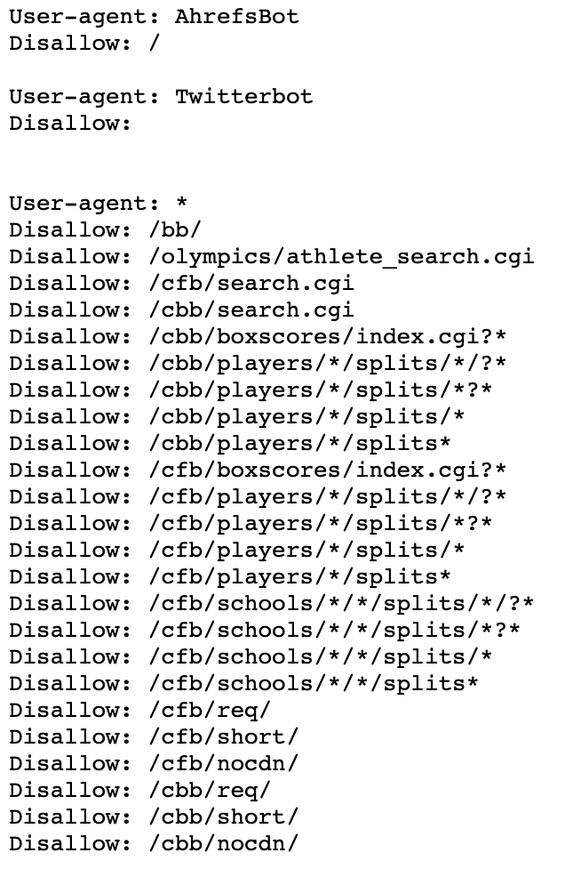

  [![MIT License][license-shield]][license-url]
  ![Language][language-shield]

<!-- PROJECT LOGO -->

 

  

  <h3 align="center">March Madness 2023</h3>
  <h3 align="center">Creator: Weston Mauz</h3>
  <h3 align="center">Project Start: September 28, 2022</h3>

---

### Project Index:

1. [Problem Statement](#1-Problem-Statement)

2. [Data extraction](#2-Data-Extraction)

3. Exploratory Data Analysis

4. Feature Engineering

5. Feature Selection

6. Model Selection

7. Model tuning

8. Model serving (if applicable)

9. [Acknowledgements](#9-Acknowledgements)

10. [License](#10-License)

# 1. Problem Statement

The purpose of this project is to produce a model to predict the winners of the 2023 March Madness college basketball tournament. 

#### Key Points:

- All data will be acquired through Beautiful Soup from: https://www.sports-reference.com/cbb/
- The programming will be done inside of jupyter notebooks
- The data will be modified & analyzed using Python w/ the Pandas package
- This project will help to practice newly acquired data science skills

#### Built With:

<!-- ##### Table 1 -->
<table border="3">

  <tr align="center">
   <td></td>
   <td></td>
   <td></td>
   <td></td>
  </tr>

 </tr>
 <tr align="center">
 
  <td><strong>Name</strong</td>
  <td>
  <a href="https://code.visualstudio.com">VSCode</a>
  </td>
  <td>
   <a href="https://jupyter.org">Jupyter</a>
  </td>
  <td>
   <a href="https://www.python.org">Python</a>
  </td>
 </tr>
 <tr align="center">
    <td><strong>Purpose</strong</td>
    <td>Code Editor</td>
    <td>Notebook</td>
    <td>Language</td>
 </tr>
</table>
<!-- Table 2 -->
<table border="3">

  <tr align="center">
   <td></td>
   <td></td>
   <td></td>
   <td></td>
  </tr>

 </tr>
 <tr align="center">
 
  <td><strong>Name</strong</td>
  <td>
  <a href="https://github.com/wmauz677">Github</a>
  </td>
  <td>
   <a href="https://iterm2.com">iTerm2</a>
  </td>
  <td>
   <a href="https://www.python.org">MacOS</a>
  </td>
 </tr>
 <tr align="center">
    <td><strong>Purpose</strong</td>
    <td>Developer Platform</td>
    <td>Terminal</td>
    <td>Operating System</td>
 </tr>
</table>

<!-- ##### Table 3 -->
<table border="3">

  <tr align="center">
   <td></td>
   <td></td>
   <td></td>
   <td></td>
  </tr>

 </tr>
 <tr align="center">
 
  <td><strong>Name</strong</td>
  <td>
  <a href="https://www.apple.com/numbers/">Numbers</a>
  </td>
  <td>
   <a href="https://scikit-learn.org/stable/">SciKit Learn</a>
  </td>
  <td>
   <a href="https://feature-engine.readthedocs.io/en/latest/">Feature Engine</a>
  </td>
 </tr>
 <tr align="center">
    <td><strong>Purpose</strong</td>
    <td>Data Visualization</td>
    <td>ML Library</td>
    <td>Data Transformation</td>
 </tr>
</table>

# 2. Data Extraction

Data will be collected for all NCAA College basketball teams on Sports Reference website: https://www.sports-reference.com/cbb/

The data to be collected:
- Team Names (ex. Colorado Buffaloes)
- Team Home Page Link ex. 0,1,2)
- Team Years (years containing stats) (ex. '2002-03')
- Stat Labels (of data to-be collected) (ex. fg_pct)

Actions to be performed:
- Establishes 'Team' Object (https://github.com/wmauz677/MarchMadness2023/blob/main/Classes/team.py)
- Creates teams_dictionary: the main data dictionary where all stats will be stored for all teams for all years
- Writes teams_dictionary to 'Data/teams_dictionary.pkl'

# 3. Exploratory Data Analysis

# 9. Acknowledgements

### Note: The crawling of College Basketball Team data is not prohibited by SportsReference.com

Data Source
* [Sports Reference](https://www.sports-reference.com/cbb/)
* [Sports Reference Robots.txt](https://www.sports-reference.com/robots.txt)

# 10. License

Distributed under the MIT License. See `LICENSE` for more information.

<!-- MARKDOWN LINKS & IMAGES -->

[language-shield]: https://img.shields.io/github/languages/top/wmauz677/MarchMadness2023?style=for-the-badge
[license-shield]: https://img.shields.io/github/license/wmauz677/marchmadness2023?style=for-the-badge
[license-url]: https://github.com/wmauz677/personalWeb/blob/gh-pages/LICENSE
[project-screenshot]: Images/project-screenshot.png

